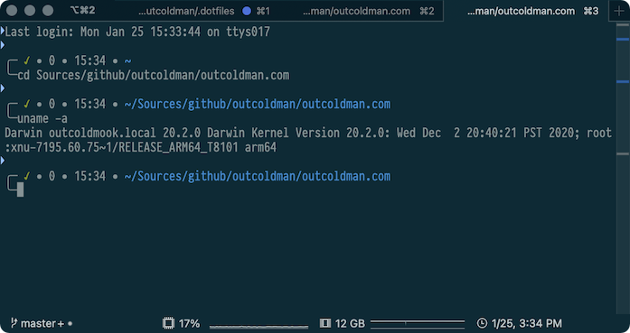
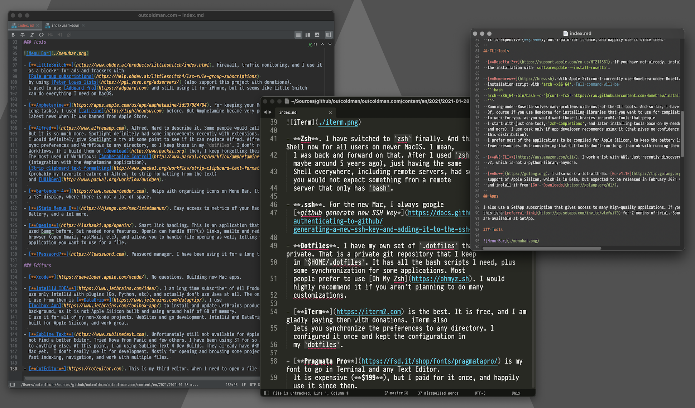
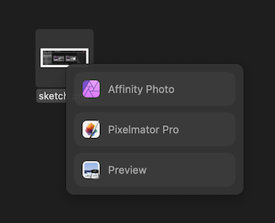

Let me start by letting you know, I love my Macbook Pro 13" M1! This laptop just finally adds the final touches of what 
I always expected from laptops: perfect battery life, silence, and no overheat (summer will tell, I guess, last year 
I had many problems with MBP 16 2019).

Today I wanted to share some configurations I make and applications I use. And since I have changed a few things since 
I transitioned to Apple Silicon, I hope you might find this helpful. If you are still deciding which Mac you want to 
buy, I would recommend looking at [whichmacshouldibuy.com](https://whichmacshouldibuy.com) (that is my site as well 
with some collaboration).

And a few notes about how I choose the applications I use:

- I intend not to keep apps that I use only a few times a year. Usually, I find a way to perform those tasks by writing 
  some scripts or finding an online service to perform this task.

- In most cases, I prefer to use Built-In applications. The second favor is for App Store applications, as I trust Apple 
  for app verification.

- I am Software Developer, but I am not hunting for Open-Source or Free applications. I respect the work that Software 
  Developers put in their applications and willing to pay for a good application.

- I would purchase a subscription for an application, but only if I use it almost every day.

- I am obviously looking only for applications built for Apple Silicon, trying to avoid Rosetta for anything that will 
  run in the background or I am going to work with for a long time.

## Terminal



- **Zsh**. I have switched to `zsh` finally. And this is a default Shell now for all users on newer MacOS. I mean, 
  I was back and forward on that. After I used `zsh` for a while (maybe around 5 years ago), just having the same 
  Shell everywhere, including remote servers, had some benefits, so you would not expect something from a remote 
  server that only has `bash`.
  
- **.ssh**. For the new Mac, I always google 
  [*github generate new SSH key*](https://docs.github.com/en/github/authenticating-to-github/generating-a-new-ssh-key-and-adding-it-to-the-ssh-agent).

- **Dotfiles**. I have my own set of `.dotfiles` that I keep private. That is a private git repository that I keep 
  in `$HOME/.dotfiles`. It has all the bash scripts I need, plus some synchronization for some applications. Most 
  people prefer to use [Oh My Zsh](https://ohmyz.sh). I would highly recommend it if you aren't planning to do many 
  customizations.

- [**iTerm**](https://iterm2.com) is the best. It is free, and I am gladly paying them with donations. iTerm also 
  lets you synchronize the preferences to any directory. I configured it once and kept the configuration in 
  my `dotfiles`.
  
- [**Pragmata Pro**](https://fsd.it/shop/fonts/pragmatapro/) is my font to go in Terminal and any Text Editor. 
  It is expensive, but I paid for it once, and happily use it since then. 
  
## CLI Tools

- [**Rosetta 2**](https://support.apple.com/en-us/HT211861). If you have not already, install Rosetta 2. You can force
  the installation with `softwareupdate --install-rosetta`.

- [**Homebrew**](https://brew.sh). With Apple Silicon I currently use Homebrew under Rosetta. Just prefix the default
  installation script with `arch -x86_64`. Full command will be 
  ```bash
  arch -x86_64 /bin/bash -c "$(curl -fsSL https://raw.githubusercontent.com/Homebrew/install/HEAD/install.sh)"
  ```
  Running under Rosetta solves many problems with most of the CLI tools. And so far, I have not found any issues. 
  Of, course if you use Homebrew for installing libraries that you want to use for compilation, that is not going 
  to work for you, as you would want those libraries in arm64. Tools that people
  I start with just one tool, `zsh-completions`, and later installing tools base on my needs (`jq`, `lnav`, `ncdu`, `tig` 
  and more). I use cask only if app developer recommends using it (that gives me confidence, that developer supports
  this distribution).
  I prefer most of the applications to be compiled for Apple Silicon, to keep the battery life longer and keep using
  fewer resources. But considering that CLI tools don't run long, I am ok with running them under Rosetta.

- [**AWS CLI**](https://aws.amazon.com/cli/). I work a lot with AWS. Just recently discovered the existence of AWS CLI 
  v2, which is not a python library anymore.
  
- [**Go**](https://golang.org). I also work a lot with Go. [Go v1.16](https://tip.golang.org/doc/go1.16) has native
  support of Apple Silicon, which is in Beta, but expected to be released in February 2021 (next month). I download
  and install it from [Go - Downloads](https://golang.org/dl/).
  
## SetApp (alternative to Apple Store)

I also use a [Setapp](https://go.setapp.com/stp313?utm_medium=vendor_program&utm_source=Denis+Gladkikh&utm_content=link) 
subscription that gives access to many high-quality applications. Some applications that I use
are available at SetApp.

## Apple Apps


I am heavily using Apple products and services:

- **Photos**. To store all my photos and videos. With 2TB iCloud plan. On iOS, I use [HashPhotos](https://www.hashphotos.app)
  as companion app for photo and videos organization. 
  
- **iCloud**. With 2TB, plenty of space to store all my documents.

- **Apple Music**. I also have Spotify plan, but mostly use Apple Music.

- **Pages**, **Numbers** and **Keynote**. I also have Microsoft Office installed, but use it probably only once a year
  for work.
  
- **Mail**. Use it with my favorite email service [FastMail](https://www.outcoldman.com/en/archive/2014/05/08/fastmail/),
  that I use for more than 6 years already. Moved everything from Gmail long time ago. FastMail has so many features,
  recommend to look at the link to my 6 years old blogpost and take a quick look at FastMail. I have a lot of custom
  domains attached, a lot of service specific email addresses, rules for organization of my emails. I don't use any
  special Mail features, everything is handled on FastMail (rules, folders), and Mail is just used as an interface
  on Mac.
  For work, I use GSuite and Gmail interface. For handling mailto links and redirect them to Mail app or Gmail I use
  OpenIn application (see below).
  
- **Notes**. Elementary notes taking application. I know there are a lot of options. But just non of them had 
  anything specific that would make me switch.

- **Reminders** and **Calendar**. There are plenty of alternatives. But these two work great for me.

## Tools


- [**LittleSnitch**](https://www.obdev.at/products/littlesnitch/index.html). Firewall, traffic monitoring, and I use it 
  as a blocker for ads and trackers with 
  [Rule group subscriptions](https://help.obdev.at/littlesnitch4/lsc-rule-group-subscriptions) 
  by using [Peter Lowes lists](https://pgl.yoyo.org/adservers/) (also support this project with donations).
  I used to use [AdGuard Pro](https://adguard.com) and still using it for iPhone, but it seems like Little Snitch 
  can do everything I need on MacOS.
  
- [**Amphetamine**](https://apps.apple.com/us/app/amphetamine/id937984704). For keeping your Mac awake (for running some 
  long tasks). I used [Caffeine](http://lightheadsw.com) before. But Amphetamine became very popular after the 
  latest news when it was banned from Apple Store.
  
- [**Alfred**](https://www.alfredapp.com). Alfred. Hard to describe it. Some people would call it a better Spotlight. 
  But it is so much more. Spotlight definitely had some improvements recently with extensions. 
  I would definitely give Spotlight a try at some point to see if it can replace Alfred. Alfred also allows you to 
  sync preferences and Workflows to any directory, so I keep those in my `dotfiles`. I don't really use a lot of 
  Workflows. If I build them or [download](http://www.packal.org) them, I keep forgetting their existence. 
  The most used of Workflows: [Amphetamine Control](http://www.packal.org/workflow/amphetamine-control) 
  (integration with the Amphetamine application), 
  [Strip clipboard text formatting](http://www.packal.org/workflow/strip-clipboard-text-formatting) 
  (probably my favorite feature of Alfred, to strip formatting from the text) 
  and [UUIDGen](http://www.packal.org/workflow/uuidgen). 
  
- [**Bartender 4**](https://www.macbartender.com). Helps with organizing icons on Menu Bar. It is useful, especially on 
  a 13" display, where there is not a lot of space.
  
- [**iStats Menus 6**](https://bjango.com/mac/istatmenus/). Easy access to metrics of your Mac. CPU, Memory, GPU, 
  Battery, and a lot more. 
  
- [**OpenIn**](https://loshadki.app/openin/). Smart link handling. This is an application that I have built. I have 
  used Bumpr before. But needed more features. OpenIn can handle HTTP(s) links, mailto and redirect them to the 
  browser (open Gmail, FastMail, etc), and allows you to handle file opening as well, letting you to choose which 
  application you want to use for a file. 
  
- [**1Password7**](https://1password.com). Password manager. I have been using it for a long time. 

## Browsers

I use **Safari** for most browsing, **Google Chrome** for work (and Gmail emails), 
[**Safari Technical Preview**](https://developer.apple.com/safari/technology-preview/) just as additional browser,
when I want to separate something from Safari. I have found Safari Technical Preview as a pretty stable browser, so
it is totally fine to use it all the time. And I also have a [FireFox](https://www.mozilla.org/en-US/firefox/new/).

All of that is supported by the [**OpenIn**](https://loshadki.app/openin/) application. To be able to select the 
right browser for a right link. 

## Editors



- [**Xcode**](https://developer.apple.com/xcode/). No questions. Building now Mac apps.

- [**IntelliJ IDEA**](https://www.jetbrains.com/idea/). I am long time subscriber of All Products Pack, but mostly
  use only IntelliJ with plugins (Go, Python, etc), and actually don't use Java at all. The only additional product that
  I use from them is [**DataGrip**](https://www.jetbrains.com/datagrip/). I use 
  [Toolbox App](https://www.jetbrains.com/toolbox-app/) to install and update JetBrains products, but don't run it in
  background, as it is not Apple Silicon built and using around half of GB of memory.
  I use it for all of my non-Xcode projects. WebSites and go development. IntelliJ and DataGrip have versions
  built for Apple Silicon, and work great.
  
- [**Sublime Text**](https://www.sublimetext.com). Unfortunately still not available for Apple Silicon. But I just could
  not find a better Editor. Tried Nova from Panic and few others. I have been using ST for so long, just cannot switch 
  to anything else. At this point, I am using Sublime Text 4 Dev Builds. They already have ARM build for Linux, but not 
  Mac yet.  I don't really use it for development. Mostly for opening and browsing some projects that require good and 
  fast indexing, navigation, and work with multiple files. 
  
- [**CotEditor**](https://coteditor.com). This is my third editor, when I need to open one file, and when I am not
  in Terminal, where I would use Vim.
  
## Photos and Video 



- **iMovie** and **Final Cut Pro**. Both from Apple. I don't really do a lot of videos. When I need to do something
  very simple, just use iMovie. When something a little bit more complicated, I use Final Cut Pro.
  
- [**Affinity Photo**](https://affinity.serif.com/en-us/photo/) and [**Pixelmator Pro**](https://www.pixelmator.com/pro/).
  I currently use both of them, but most of the time, Pixelmator is winning. Don't do a lot of Photo editing, but when
  I do, usually find some manual on Web how to do that or that, and depends which tool they recommend - I use one of the
  products.
  
- [**Monosnap**](https://monosnap.com). When default Screenshot application is not enough, I go to Monosnap. It also
  allows me to create Gifs from screen recordings.
  
## Design


- [**Sketch**](https://www.sketch.com). Especially with Sketch templates from 
  [Apple Design Resources](https://developer.apple.com/design/resources/). Use it for designing most of the icons,
  screenshots for Apple Store, web design mockups, and more. Have not tried it yet, there is also a third party
  [Big Sur UI Kit for Sketch](https://www.macos-uikit.xyz/).
  
- [**Affinity Designer**](https://affinity.serif.com/en-us/). When I cannot do something more complicated
  in Sketch, I use Affinity Designer. That is probably a reason why I have *Affinity Photo* installed as well. And
  also have *Affinity Publisher*, but don't think I have ever used it.

## Developers

- [Sublime Merge](https://www.sublimemerge.com). Unfortunately, no Apple Silicon support yet. But similar to Sublime 
  Text, I love this product. Most of the work with git I do with a terminal. SM I use mostly for reviewing changes.
  
- [Kaleidoscope](https://kaleidoscope.app). When I need to diff something outside of git, I use Kaleidoscope.

- [RegExp](https://loshadki.app/regexp/). I use Regular Expressions a lot. When I need to share something with the
  customers, I use (regex101.com)[https://regex101.com]. For offline work I have built my own application RegExp.

## Apple developers

- [A Companion for SwiftUI](https://swiftui-lab.com/companion/). I have found this application just recently. My main
  focus is on building macOS and iOS applications using SwiftUI. And documentation for SwiftUI is not great. The author
  of this application did a tremendous job by combining good documentation and including many examples. I am still
  in the middle of learning. This application is not free and maybe a little more expensive than others, but after
  reading the reviews, I have decided to give it a try. If you are not willing to purchase this app, there are
  few resources for you on SwiftUI:
  - [The Complete SwiftUI Documentation You’ve Been Waiting For](https://medium.com/better-programming/the-complete-swiftui-documentation-youve-been-waiting-for-fdfe7241add9)
  - [https://bananadocs.org](https://bananadocs.org)

- [SF Symbols](https://developer.apple.com/sf-symbols/). Finding symbols from SF Fonts.

## Virtual Machines and Remote Desktops

- **Docker and Kubernetes**. One option is to use Docker for Mac (M1 Preview), but to be honest, I never use their UI, 
  and considering that they are in Preview, I am slowly switching to [vmcli](https://github.com/gyf304/vmcli). 
  This CLI tool can quickly manage Ubuntu 
  Virtual Machines from your terminal. You can install the ARM version of Docker or  Kubernetes and run it in these VMs.
  
- [**Jump Desktop**](https://jumpdesktop.com). Jump Desktop is two tools in one. You can use it to connect to local 
  machines using RDP or VNC. Or you can use it with [Jump Desktop Connect](https://jumpdesktop.com/connect/) to access 
  remote machines by using their [Fluid Remote Desktop protocol](https://support.jumpdesktop.com/hc/en-us/articles/216423983).
  
- [**Parallels Desktop**](https://www.parallels.com). Version for Apple Silicon is in 
  [preview](https://www.parallels.com/blogs/parallels-desktop-apple-silicon-mac/). I don't have a lot of needs in Windows. 
  And the Windows that you can install in Parallels is 
  [Windows ARM Insider Build](https://www.microsoft.com/en-us/software-download/windowsinsiderpreviewARM64), 
  which can run non ARM applications, they will run under an emulator (which is also in Preview). 
  Running Windows apps under emulator in Virtual Machine seems like overkill. But if you are not comfortable with 
  Ubuntu using ssh and terminal only, you can use it for running Ubuntu with GUI.

I run Parallels on Mac Mini, with multiple MacOS virtual machines to test my applications on previous versions of MacOS. 
Using Jump Desktop with Jump Desktop Connect, this is my own private cloud, which I can access anywhere.

## Cleaning and configurations

- [UninstallPKG](https://www.corecode.io/uninstallpkg/). Many apps install pkg, or maybe you install some (for example, 
  Go). If you want to clean them, use UninstallPKG.

- [Daisy Disk](https://daisydiskapp.com). A lot of people use MacOS cleaner apps. I just use DaisyDisk and explore 
  what takes too much space and clean it when I need it. An alternative in a terminal I sometimes use `ncdu` (you
  can install it with `brew`).

- [TinkerTool](https://www.bresink.com/osx/TinkerTool.html). If you need to fine-tune some preferences in your Mac. 
  I use it only for removing shades from the window screenshots.

## RSS

- [**Reeder**](https://reeder.app). Probably use it since version 2. Don't think a lot of things have changed since then. 
  But keep supporting the author. I am still a huge RSS reader. Also, you can use RSS readers to 
  [read reddit](https://www.reddit.com/wiki/rss).

## Messengers and Meetings

I am not sure what the point is for me to share the messengers I use. Considering that everybody has their own 
preferences. But just want to mention Slack. I use it a lot for work and communities: Docker, Kubernetes, OpenShift, 
Nomad, Golang, Splunk. And a few communities for the Apple Developers:

- [AppKit Abusers](https://appkit-abusers.herokuapp.com).

- [iOS Developers](https://ios-developers.io).

For meetings, I have WebEx and Zoom installed. Primary for work.

## Games

I have an Apple Arcade subscription (considering that I have Apple One). There are a lot of nice games over there. 
But I don't play a lot of games. And most of the games I want to play are Windows-only. So I have found a 
solution to use Google Stadia on Mac. Works perfectly.

You can use my [referral link for Google Stadia](https://stadia.com/link/referrals?si_rid=2261358621061005807&si_rt=1), 
with an additional month of Stadia Pro to play many AAA games, 
including DOOM, DOOM Eternal, Cyberpunk 2077, and more. You don't need Google Stadia Pro for playing games, it is only
if you want to play them in 4K (which is not supported on MacOS).


## Summary

I probably missed something and will keep updating this blog post when discovering something new.

There are some MacOS application collections, if you are looking for more applications. 

- [Mac App Collection](https://renegadevi.gitlab.io/mac-app-collection/apps/).

- [Awesome macOS open source applications](https://github.com/serhii-londar/open-source-mac-os-apps).

