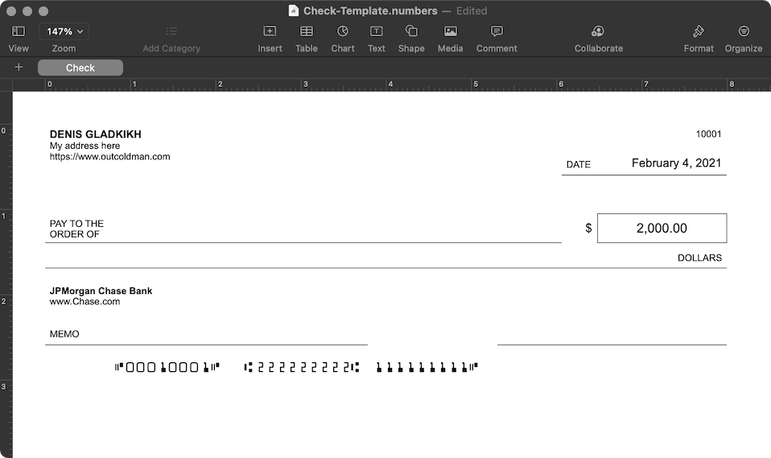

Really short and simple life-hack. 

Sometimes we have to pay for a few things with personal bank checks. Some
banks charge you like `$1` per one check, some banks give you `100` or `500` checks for free. And both options don't
really work for me. To get those checks, you have to go to the office or order them online and wait. Or if you get those
`100-500` checks, I usually use only `5` of them before I move to a new place, and have to reorder and burn an old batch.
What a waste!

So I started to think about if there is an option to print personal checks myself. 
Many apps exist on Apple Store and online, which can format checks for you. So it should be possible.
And turns out you can actually write a check on a napkin, and this is going to be a valid check, but some sellers might refuse to
accept it. So how to make it more legit? 
  
At first, you need to buy check paper, like 
[this one](https://www.amazon.com/gp/product/B00L3NC8A8/ref=as_li_tl?ie=UTF8&camp=1789&creative=9325&creativeASIN=B00L3NC8A8&linkCode=as2&tag=outcoldman-20&linkId=9d3d7c01e75b2e9ddc98d17f2a0a112d).
Second, you need to format a template to print over this paper. To do that you can purchase one of the online or
Apple Store applications. They are pretty expensive (minimum `$30`), and considering that I want it only for like
5 checks per year, did not want to go with this route. 

Instead, I have found a free [MICR font](https://en.wikipedia.org/wiki/Magnetic_ink_character_recognition) on
[github.com/andrewstellman/excel-check-printing](https://github.com/andrewstellman/excel-check-printing) 
and an Excel template to print the checks.
You can also do one more step and purchase MICR Ink for your printer
(if you can find a cartridge compatible with your printer). After some research, I decided not to do that as most banks 
now scan the checks the same way as you deposit checks via Mobile applications. 
If the scan did not work, they would type information in their software manually.

This template did not work with Microsoft Excel for Mac. Macros kept crashing the Excel. Instead, I built a very similar 
template with Numbers application using the Microsoft Excel template as a reference.

