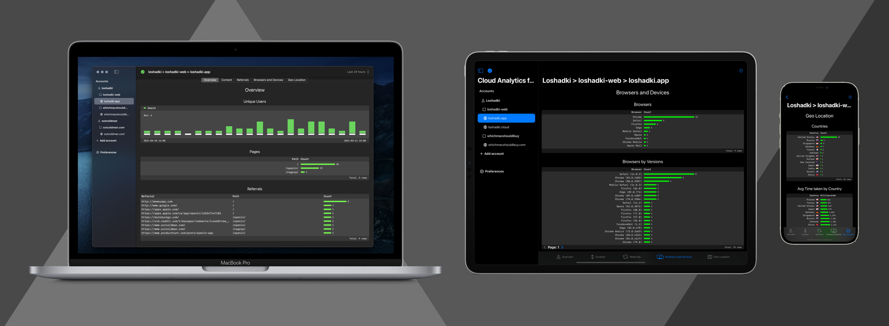

I wrote two parts about how you can analyze the Access Logs from AWS Amplify. And it was a time to write a 
third part of the series.

But after touching AWS QuickSight again (I use it for [Outcold Solutions](https://www.outcoldsolutions.com)) 
I realized that I don't want to go through configuring it. As it is purely drag and drop way of building dashboards, 
and I am not very happy with that. Another option was to use AWS SES with lambdas to run SQL over Athena and send 
reports as CSV or nicely formatted emails with AWS SES. But if you have ever built yourself an email template, 
you know that it is not an easy task as well. HTML is limited in emails, and you have to be very careful with what you use.

But considering my new hobby of building Mac applications, I thought, why not try to make an application that 
will download the Access Logs locally, store them in a local database, and show various reports.

## Meet CloudAnalytics for AWS Amplify

[CloudAnalytics for AWS Amplify](https://loshadki.app/cloudanalytics/) is a native application written in SwiftUI for 
Mac, iPhone, and iPad. I use it now for all the websites that I host on AWS Amplify (this blog, the website of 
loshadki.app, and a few more). This blog has probably the most significant amount of access logs, around 10,000 
entries per day, so it takes a while to download them (a few minutes for two weeks of records, that is the maximum 
you can get from AWS Amplify).

I use SQLite3 as a database, and the best thing about the SQLite3 and access logs, this data is compressed very well 
in the database format, as most row values are repeated. For all my websites, the database is below 200MB.

You can download the Mac application for free from [CloudAnalytics for AWS Amplify](https://loshadki.app/cloudanalytics/), 
or you can purchase it for `$9.99` from App Store, one purchase for all platforms (iPhone, iPad, and Mac). 
Big Sur and iOS/iPadOS 14+ only.

## Libraries or self-written code

I always try to avoid using any libraries if it is possible. The main reason for that I like to learn. 
Writing code is fun, and when you are building your code instead of using libraries - you are usually learning a lot. 
And from my experience, it feels like time spending on understanding how the library works, doing some quick audit of it, 
comparing to just building your library is very close.

Another reason is capabilities. There is always a chance that you might need something that is not available in the 
library, and in the end, you will end up with the decision to make. If the library is not very well-supported, you 
will have to create a Fork, a Patch. Even if the library is  well-supported, you might end up waiting for the release you
need.

The size is everything. The application that I have built is less than `3MB` in size when you download it from Apple Store.
Funny thing, most of the app's size is taken by the GeoLite2 CSV database and the User-Agent Parser definitions.

I tried to use [Soto](https://github.com/soto-project/soto) as AWS Client library, but just for the three calls that 
I need it for, it increased the size of the app with `12MB`. So I have spent a few hours building my code for AWS API.

The same about SQLite3 libraries. Instead, I just used the SQLite C functions to work with SQLite and made a pretty 
performant library work with the database. While writing it in Swift, I realized that I had worked with C-functions 
in SQLite before, while I was building
[outcoldplayer (unofficial Google Music Player for Windows)](https://www.outcoldman.com/en/archive/2015/06/08/good-bye-outcoldplayer/)

## SwiftUI for iOS and macOS

Apple advertised SwiftUI as an easy way to build cross-platform applications, and some steps are undoubtedly simple. 
Except for a few
parts, many Form components render weird on macOS but look pretty nice on iOS. So I had to write different views for 
macOS and iOS for most of the forms, where users need to enter the data. Everything else worked perfectly, my custom dashboards, charts, and almost 99% of the code. I was not planning to build iPhone and iPad applications, but I decided to make a cross-platform app just after trying how easy it was.

And considering that I have built a macOS application first, there are probably some UI glitches in the iOS app, 
but nothing serious would prevent you from using the app. Next time I would start from the iOS application and port it later to Mac.

And in general, it feels like SwiftUI is still a long way to go to provide a good UI framework. So many issues, 
glitches, workarounds you need to find to make things work as you want.

## What next?

If you like it, feel free to drop me an email with some suggestions. You can find an SQLite database and run some 
custom SQL to find some other data you are looking for (you can find it under 
`~/Library/Containers/app.loshadki.cloudanalytics/Data/Library/Application Support/db/db.sqlite`). 
If you feel like there could be some other valuable dashboards, please let me know. I would be happy to add them. 

It is probably possible to also download CloudFront logs from S3 to the application to monitor S3 based websites
hosted behind CloudFront. Maybe S3 access logs as well. CloudTrail, maybe?

That was a fun project. I hope you will like it!